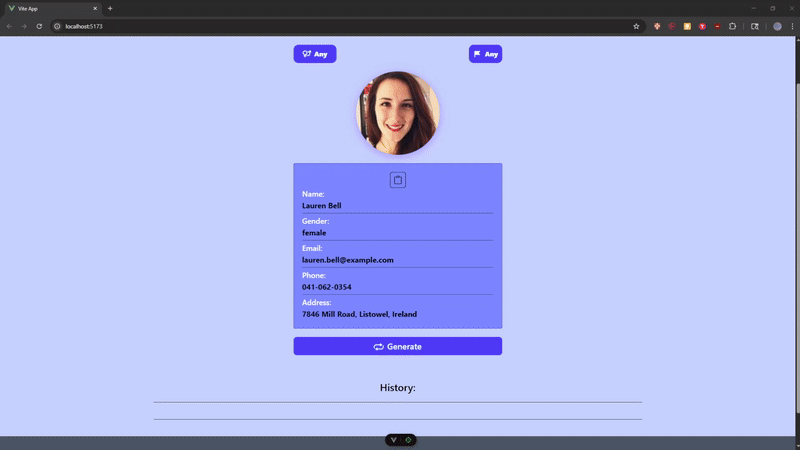

# Rand-User-App
Проект представляет собой веб-приложение для генерации случайного фейкового пользователя c использованием Vue 3, TypeScript и randomuser API.

[**_<ins>Ссылка на приложение</ins>_**](https://rand-user-app.vercel.app/)

## 🚀 Демо 
*Пример работы приложения* 
  

## 🛠 Технологии  
- **Frontend**: Vue 3, TypeScript, Axios, Pinia, Tailwind, Vite, Simplebar
- **Backend**: API https://randomuser.me/
- **Deploy**: Vercel  

## ⚡️ Функционал 
✅ Генерация случайного фейкового пользователя

✅ Выбор пола генерируемого пользователя

✅ Выбор национальности генерируемого пользователя

✅ Копирование данных сгенерированного пользователя

✅ Сохранение последних сгенерированных пользователей в LocalStorage

✅ Адаптивный интерфейс

## 🚀 Установка  
```bash
git clone https://github.com/chocopie777/rand-user-app.git

npm install

npm run dev